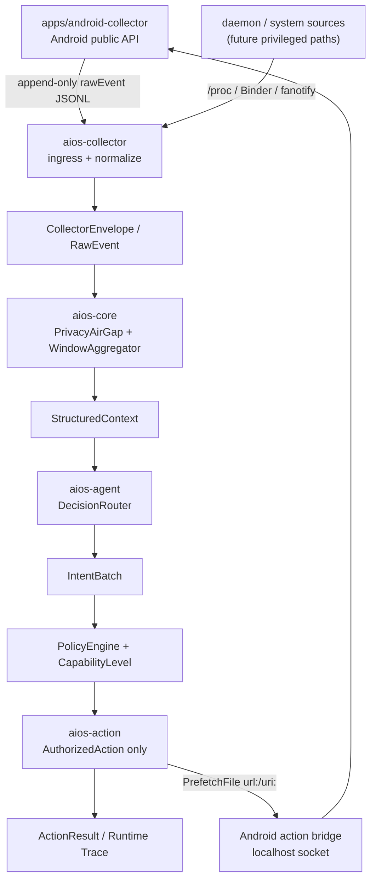

> [!IMPORTANT]
> This is a mirror of [114August514/DiPECS](https://github.com/114August514/DiPECS). Please contribute there.

# DiPECS

[](rust-toolchain.toml)
[](apps/android-collector/app/build.gradle.kts)
[](scripts/setup-env.sh)
[](LICENSE)

DiPECS (Digital Intelligence Platform for Efficient Computing Systems) is an
Android/Linux AIOS prototype. It separates collection, privacy sanitization,
context aggregation, decision routing, policy review, and authorized action
execution so raw local signals do not flow directly into model backends or
action executors.

## Current Status

Implemented:

- `aios-spec` defines `RawEvent`, `CollectorEnvelope`, `SanitizedEvent`,
  `StructuredContext`, `IntentBatch`, and `CapabilityLevel`.
- `aios-core` constructs the non-forgeable `AuthorizedAction` through
  `ActionLifecycle`; `aios-action` only receives it.
- `apps/android-collector` is the Android public-API collector. Promoted sources
  write Rust-compatible `rawEvent` JSONL rows; optional sources remain available
  for interface screening.
- `aios-collector` parses Android append-only JSONL into `CollectorEnvelope`
  with `SourceTier::PublicApi`, and exposes Binder/eBPF and fanotify monitor
  interfaces that safely degrade when privileged deployment is absent.
- `aios-core` performs `PrivacyAirGap` sanitization, window aggregation,
  privacy-preserving model memory, policy checks, golden trace replay, and
  privacy leak regression tests.
- `aios-agent` provides `DecisionRouter`, `RuleBasedBackend`,
  `LocalEvaluatorBackend`, `CloudLlmBackend`, and `FallbackNoOpBackend`; cloud
  prompts receive `ModelInput` with the current context, behavior profile, and
  recent decision feedback.
- `CloudLlmBackend` supports DeepSeek, Qwen/DashScope, and generic
  OpenAI-compatible endpoints.
- `aios-action` keeps local replay fallback behavior and can forward
  Android-safe `PrefetchFile`, `ReleaseMemory`, `KeepAlive`, and
  `PreWarmProcess` subsets to the Android localhost bridge.
- `aios-cli` provides Android JSONL replay, audit hash output, and Android
  `AuthorizedAction` socket tooling.
- `aios-daemon` runs the long-lived pipeline and can record runtime window
  traces with `--trace-output`.

Still in progress:

- Emulator-first Android action bridge smoke coverage in CI.
- LocalEvaluator backend hardening.
- True privileged deployment for system-level collection routes: fanotify fd
  attachment, Binder/eBPF program loading, and system image integration.

## Architecture



Core boundaries:

- Android collector production ingress is append-only JSONL:
  `dipecsd --android-trace-jsonl <actions.jsonl>` tails newly appended
  `rawEvent` rows.
- `RawEvent` does not cross `PrivacyAirGap`; model backends only receive
  `StructuredContext`.
- Decision backends output only `IntentBatch`; action execution accepts only
  `AuthorizedAction`.
- Android action socket pings require `auth_token`; `aios-action` dispatch uses
  an execute envelope with a short freshness window and HMAC-SHA256 over the
  freshness window plus length-prefixed serialized `AuthorizedAction`. The
  shared token is stored in Android `EncryptedSharedPreferences` and is injected
  by CLI/bridge tooling.

## Quick Start

Run Rust checks:

```bash
cargo fmt --all -- --check
cargo clippy --workspace --all-targets --all-features -- -D warnings
cargo test --workspace
```

Run daemon in foreground:

```bash
RUST_LOG=info cargo run -p aios-daemon --bin dipecsd -- --no-daemon
```

Run daemon with Android JSONL ingress:

```bash
RUST_LOG=info cargo run -p aios-daemon --bin dipecsd -- \
  --no-daemon \
  --android-trace-jsonl apps/android-collector/actions.jsonl \
  --trace-output data/evaluation/runtime.ndjson
```

Replay an Android JSONL trace:

```bash
cargo run -p aios-cli -- replay data/traces/sample_replay.jsonl \
  --stages policy \
  --audit data/evaluation/audit.ndjson
```

Replay the larger synthetic Android trace when real-device data is not
available:

```bash
python tools/generate_synthetic_android_trace.py --rows 2400
cargo run -p aios-cli -- replay data/traces/android_synthetic_large.redacted.jsonl \
  --stages policy \
  --audit data/evaluation/android_synthetic_large.audit.ndjson
```

`data/traces/android_synthetic_large.redacted.jsonl` is deterministic,
redacted, and explicitly synthetic. It is suitable for dashboard, replay, and
policy/audit demos, but it is not real-device validation evidence.

## Build Documentation and Academic Reports

Build the MkDocs knowledge base and Rust API docs:

```bash
cd docs
uv sync --frozen
uv run env PYTHONPATH=. mkdocs build
```

Build the LaTeX academic reports (requires a TeX Live distribution with
XeLaTeX, Chinese fonts, and `latexmk`):

```bash
./scripts/build-academic-reports.sh
```

The generated PDFs are placed in each report directory (e.g.
`docs/academic-src/04_Final_Report/main.pdf`). In CI, the Docs workflow also
copies them to `docs/site/academic/reports/` so that the published site can
link to them.

Build Android collector:

```bash
cd apps/android-collector
./gradlew :app:assembleDebug
```

Local Android builds require Android SDK Platform 35. In GitHub Actions this is
installed by `.github/workflows/android-collector.yml`.

Ping the Android action socket with its auth token:

```bash
cargo run -p aios-cli -- send-authorized-action \
  --auth-token <token-copied-from-app> \
  --host 127.0.0.1 \
  --port 46321
```

This CLI command is a health-check ping. Real prefetch dispatch is produced by
`aios-action` after `ActionLifecycle` seals an `AuthorizedAction`; the Android
side rejects unsigned, stale, or malformed action payloads.

For Android Studio emulator validation on Windows, the end-to-end setup is
scripted:

```powershell
.\scripts\start-android-emulator.ps1
```

It creates/starts the `dipecs_emu` API 35 emulator, installs the debug APK,
forwards `tcp:46321`, starts the app and debug collector, and pings the action socket with a built-in TCP health check.
Enable direct forwarding from `aios-action` to Android:

```bash
DIPECS_ANDROID_ACTION_BRIDGE_ENABLED=true
DIPECS_ANDROID_ACTION_BRIDGE_HOST=127.0.0.1
DIPECS_ANDROID_ACTION_BRIDGE_PORT=46321
DIPECS_ANDROID_ACTION_BRIDGE_TOKEN=dipecs-dev-emulator-shared-token-00000000
```

Android Studio debug builds use `dipecs-dev-emulator-shared-token-00000000` on first launch unless an
adb property overrides it:

```bash
adb shell setprop debug.dipecs.token my-local-debug-token
adb shell pm clear com.dipecs.collector  # only needed if a token was already stored
```

Release builds still generate a random token in `EncryptedSharedPreferences`;
use **Copy Action Socket Token** from the app for release validation.

Enable cloud LLM routing:

```bash
cp .env.example .env
# Set DIPECS_CLOUD_LLM_ENABLED=true and the provider API key.
```

Enable model memory persistence and optional LLM habit summaries:

```bash
DIPECS_MODEL_MEMORY_PATH=data/runtime/model_memory.json
DIPECS_MODEL_MEMORY_RECENT_WINDOWS=5
DIPECS_MODEL_MEMORY_TOP_K=8
DIPECS_PROFILE_SUMMARY_ENABLED=true
DIPECS_PROFILE_SUMMARY_INTERVAL_WINDOWS=10
```

## Android Production Sources

Promoted into production ingress:

- `UsageStatsManager` -> `RawEvent::AppTransition`
- `NotificationListenerService` -> `RawEvent::NotificationPosted` /
  `RawEvent::NotificationInteraction`
- `DeviceContext` -> `RawEvent::SystemState`

Still screening:

- `AccessibilityService` events can be previewed in the app, but rows with
  `rawEvent: null` are skipped by Rust production ingress until a Rust schema is
  accepted.

## Repository Map

| Path | Purpose |
| :--- | :--- |
| `crates/aios-spec` | Cross-crate protocol, data model, and traits. |
| `crates/aios-collector` | Rust collector ingress and Android JSONL tailer. |
| `crates/aios-core` | Privacy air-gap, aggregation, policy, replay validation. |
| `crates/aios-agent` | Decision routing and rule/cloud/fallback backends. |
| `crates/aios-action` | Authorized action execution and Android bridge forwarding. |
| `crates/aios-daemon` | `dipecsd` runtime pipeline. |
| `crates/aios-cli` | Replay, audit, and Android action socket tooling. |
| `apps/android-collector` | Android public-API collector and action bridge. |
| `tools/trace-dashboard` | Local-only static viewer for sanitized JSONL and replay/audit NDJSON. |
| `docs/src` | MkDocs Material documentation. |
| `docs/academic-src` | Academic report sources. |

## Documentation

Text files are normalized with LF endings through `.gitattributes`; keep
`cargo fmt --all -- --check` and `git diff --check` green before submitting.

Local preview:

```bash
cd docs
uv sync
PYTHONPATH=. uv run mkdocs build
PYTHONPATH=. uv run mkdocs serve
```

- [Architecture Overview](docs/src/architecture/index.md)
- [Pipeline and Runtime](docs/src/architecture/pipeline.md)
- [Android Collector](docs/src/android/collector.md)
- [Android Real-Device Validation](docs/src/android/real-device-validation.md)
- [Android Security and Privacy Boundary](docs/src/android/security-privacy.md)
- [Android Action Boundary](docs/src/android/action-boundary.md)
- [RFC-0001](docs/src/rfc/0001-layered-collection-and-decision-routing.md)
- [Android Collector App](apps/android-collector/README.md)

## License

DiPECS is licensed under [Apache License 2.0](LICENSE).
