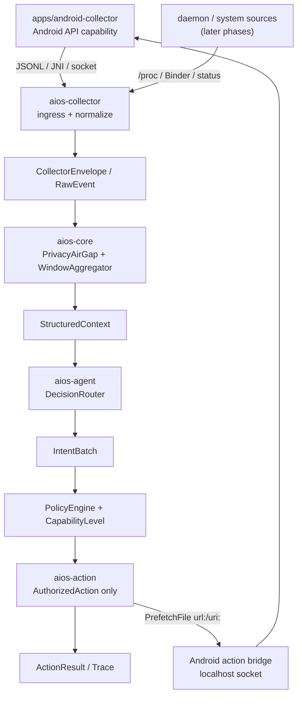

# DiPECS

[](rust-toolchain.toml)
[](scripts/setup-env.sh)
[](scripts/setup-env.sh)
[](LICENSE)

DiPECS (Digital Intelligence Platform for Efficient Computing Systems) 是一个面向 Android/Linux 的 AIOS 原型。它把设备侧观测、隐私脱敏、上下文聚合、决策路由、策略审查和动作执行拆成明确边界，让本地系统保留安全和实时性，并在需要时把脱敏后的结构化上下文交给更强的推理后端。

当前代码以 v0.2 最小闭环为基线，并通过 [RFC-0001](docs/src/design/rfc/0001-layered-collection-and-decision-routing.md) 收紧采集、脱敏、决策和动作边界。更完整的架构说明见 [架构概览](docs/src/design/overview.md) 和 [代码地图](docs/src/design/crates-map.md)。

## Status

已落地：

- `aios-spec` 定义 `RawEvent`、`CollectorEnvelope`、`SanitizedEvent`、`StructuredContext`、`IntentBatch`、`CapabilityLevel` 和 `AuthorizedAction`。
- `apps/android-collector` 验证 Android 用户态采集能力，并导出 JSONL trace 样本。
- `aios-collector` 作为 Rust 采集层入口，统一产出 `CollectorEnvelope` / `RawEvent`，并支持 Android collector append-only JSONL 接入。
- `aios-core` 完成隐私脱敏、窗口聚合、策略审查和 Golden Trace 语义校验。
- `aios-agent` 提供 `DecisionRouter`、`RuleBasedBackend`、`CloudLlmBackend` 和 `FallbackNoOpBackend`。
- `aios-action` 保留本地 replay stub，并可将 `PrefetchFile(url:/uri:)` 授权动作转发到 Android localhost bridge。
- `aios-cli` 提供 JSONL replay、稳定 audit hash 和 Android `AuthorizedAction` socket 调试工具。
- `aios-daemon` 提供 `dipecsd` 长驻运行时，串联采集、脱敏、聚合、决策、策略和动作执行。

仍在推进：

- 本地小模型 / LocalEvaluator 后端。
- 更多 Android-safe 真机动作（目前优先落地的是可访问内容预取）。
- Golden Trace 录制接入 daemon 主循环与 CI replay 报告。

## Architecture



核心边界：

- apps 提供采集能力，`aios-collector` 负责接入与 `RawEvent` 规范化。
- Android collector 的生产接入通道是 append-only JSONL：`dipecsd --android-trace-jsonl <actions.jsonl>` 会持续消费新增 `rawEvent` 行。
- `RawEvent` 不越过 `PrivacyAirGap`；推理层只接收 `StructuredContext`。
- 推理后端只能输出 `IntentBatch`；动作层只执行 `AuthorizedAction`。

## Quick Start

运行 Rust 测试：

```bash
cargo test --workspace
```

以前台模式运行 daemon：

```bash
RUST_LOG=info cargo run -p aios-daemon --bin dipecsd -- --no-daemon
```

以前台模式运行 daemon，并接入 Android collector 导出的 JSONL：

```bash
RUST_LOG=info cargo run -p aios-daemon --bin dipecsd -- --no-daemon --android-trace-jsonl apps/android-collector/actions.jsonl
```

记录 daemon 运行时窗口 trace：

```bash
RUST_LOG=info cargo run -p aios-daemon --bin dipecsd -- --no-daemon --android-trace-jsonl apps/android-collector/actions.jsonl --trace-output data/evaluation/runtime.ndjson
```

配置 Android 交叉编译：

```bash
source scripts/setup-env.sh
cargo android-release
```

构建 Android collector：

```bash
cd apps/android-collector
./gradlew :app:assembleDebug
```

回放 Android JSONL trace：

```bash
cargo run -p aios-cli -- replay data/traces/sample_replay.jsonl --stages policy --audit data/evaluation/audit.ndjson
```

启用云端 LLM 后端：

```bash
cp .env.example .env
# 编辑 .env 后加载环境变量，例如 DIPECS_CLOUD_LLM_ENABLED=true 和 API key
```

向 Android localhost bridge 发送一个授权预取动作：

```bash
cargo run -p aios-cli -- send-authorized-action --prefetch-target url:https://example.test/feed.json --auth-token <token-copied-from-app> --host 127.0.0.1 --port 46321
```

完整开发命令见 [开发指南](docs/src/team/dev.md)，Android collector 细节见 [apps/android-collector/README.md](apps/android-collector/README.md)。

## Repository Map

| Path | Purpose |
| :--- | :--- |
| `crates/aios-spec` | 跨层协议和 trait。 |
| `crates/aios-collector` | Rust 采集层入口。 |
| `crates/aios-core` | 脱敏、聚合、策略审查。 |
| `crates/aios-agent` | 决策路由和模型后端。 |
| `crates/aios-action` | 授权动作执行。 |
| `crates/aios-daemon` | `dipecsd` 运行时装配。 |
| `crates/aios-cli` | replay、audit hash 和 Android action bridge 调试工具。 |
| `apps/android-collector` | Android 采集能力验证工具。 |
| `docs/src` | MkDocs Material 工程文档。 |
| `docs/academic-src` | 学术报告的 LaTeX 源码。 |

## Documentation

完整工程文档使用 MkDocs Material 管理，CI 自动部署至 [GitHub Pages](https://114august514.github.io/DiPECS/)。

本地预览：

```bash
cd docs
uv sync                    # 首次：创建 .venv + 安装依赖
PYTHONPATH=. uv run mkdocs build        # 构建
PYTHONPATH=. uv run mkdocs serve        # 本地预览 (http://127.0.0.1:8000)
```

- [架构概览](docs/src/design/overview.md)
- [设计哲学](docs/src/design/philosophy.md)
- [Daemon 架构](docs/src/design/daemon-architecture.md)
- [Android 接口 MVP](docs/src/design/android-interface-mvp.md)
- [RFC 流程](docs/src/design/rfc/process.md)
- [RFC-0001 分层采集与决策路由](docs/src/design/rfc/0001-layered-collection-and-decision-routing.md)
- [学术材料](docs/src/academic/index.md)
- [参考资料](docs/src/refs/index.md)
- [开发指南](docs/src/team/dev.md)
- [贡献指南](CONTRIBUTING.md)

## License

DiPECS 使用 [Apache License 2.0](LICENSE) 授权。
