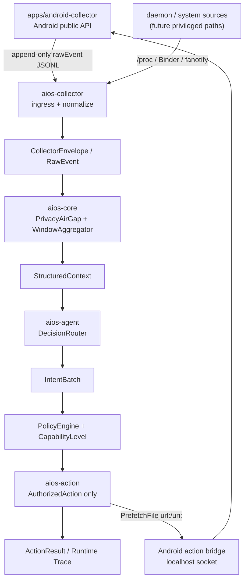

# DiPECS

[](rust-toolchain.toml)
[](scripts/setup-env.sh)
[](scripts/setup-env.sh)
[](LICENSE)

DiPECS (Digital Intelligence Platform for Efficient Computing Systems) is an
Android/Linux AIOS prototype. It separates collection, privacy sanitization,
context aggregation, decision routing, policy review, and authorized action
execution so raw local signals do not flow directly into model backends or
action executors.

## Current Status

Implemented:

- `aios-spec` defines `RawEvent`, `CollectorEnvelope`, `SanitizedEvent`,
  `StructuredContext`, `IntentBatch`, `CapabilityLevel`, and `AuthorizedAction`.
- `apps/android-collector` is the Android public-API collector. Promoted sources
  write Rust-compatible `rawEvent` JSONL rows; optional sources remain available
  for interface screening.
- `aios-collector` parses Android append-only JSONL into `CollectorEnvelope`
  with `SourceTier::PublicApi`.
- `aios-core` performs `PrivacyAirGap` sanitization, window aggregation,
  policy checks, golden trace replay, and privacy leak regression tests.
- `aios-agent` provides `DecisionRouter`, `RuleBasedBackend`,
  `CloudLlmBackend`, and `FallbackNoOpBackend`.
- `CloudLlmBackend` supports DeepSeek, Qwen/DashScope, and generic
  OpenAI-compatible endpoints.
- `aios-action` keeps local replay fallback behavior and can forward
  `PrefetchFile(url:/uri:)` actions to the Android localhost bridge.
- `aios-cli` provides Android JSONL replay, audit hash output, and Android
  `AuthorizedAction` socket tooling.
- `aios-daemon` runs the long-lived pipeline and can record runtime window
  traces with `--trace-output`.

Still in progress:

- More Android-safe real actions beyond accessible-content prefetch.
- LocalEvaluator backend.
- True device validation for the Android APK and action bridge.
- System-level collection routes such as fanotify, Binder/eBPF, and system image
  deployment.

## Architecture



Core boundaries:

- Android collector production ingress is append-only JSONL:
  `dipecsd --android-trace-jsonl <actions.jsonl>` tails newly appended
  `rawEvent` rows.
- `RawEvent` does not cross `PrivacyAirGap`; model backends only receive
  `StructuredContext`.
- Decision backends output only `IntentBatch`; action execution accepts only
  `AuthorizedAction`.
- Android action socket payloads require `auth_token`; the token is stored in
  Android `EncryptedSharedPreferences` and is injected by CLI/bridge tooling.

## Quick Start

Run Rust checks:

```bash
cargo fmt --all -- --check
cargo clippy --workspace --all-targets --all-features -- -D warnings
cargo test --workspace
```

Run daemon in foreground:

```bash
RUST_LOG=info cargo run -p aios-daemon --bin dipecsd -- --no-daemon
```

Run daemon with Android JSONL ingress:

```bash
RUST_LOG=info cargo run -p aios-daemon --bin dipecsd -- \
  --no-daemon \
  --android-trace-jsonl apps/android-collector/actions.jsonl \
  --trace-output data/evaluation/runtime.ndjson
```

Replay an Android JSONL trace:

```bash
cargo run -p aios-cli -- replay data/traces/sample_replay.jsonl \
  --stages policy \
  --audit data/evaluation/audit.ndjson
```

Build Android collector:

```bash
cd apps/android-collector
./gradlew :app:assembleDebug
```

Local Android builds require Android SDK Platform 35. In GitHub Actions this is
installed by `.github/workflows/android-collector.yml`.

Send an authorized Android prefetch action:

```bash
cargo run -p aios-cli -- send-authorized-action \
  --prefetch-target url:https://example.test/feed.json \
  --auth-token <token-copied-from-app> \
  --host 127.0.0.1 \
  --port 46321
```

Enable direct forwarding from `aios-action` to Android:

```bash
DIPECS_ANDROID_ACTION_BRIDGE_ENABLED=true
DIPECS_ANDROID_ACTION_BRIDGE_HOST=127.0.0.1
DIPECS_ANDROID_ACTION_BRIDGE_PORT=46321
DIPECS_ANDROID_ACTION_BRIDGE_TOKEN=<token-copied-from-app>
```

Enable cloud LLM routing:

```bash
cp .env.example .env
# Set DIPECS_CLOUD_LLM_ENABLED=true and the provider API key.
```

## Android Production Sources

Promoted into production ingress:

- `UsageStatsManager` -> `RawEvent::AppTransition`
- `NotificationListenerService` -> `RawEvent::NotificationPosted` /
  `RawEvent::NotificationInteraction`
- `DeviceContext` -> `RawEvent::SystemState`

Still screening:

- `AccessibilityService` events can be previewed in the app, but rows with
  `rawEvent: null` are skipped by Rust production ingress until a Rust schema is
  accepted.

## Repository Map

| Path | Purpose |
| :--- | :--- |
| `crates/aios-spec` | Cross-crate protocol, data model, and traits. |
| `crates/aios-collector` | Rust collector ingress and Android JSONL tailer. |
| `crates/aios-core` | Privacy air-gap, aggregation, policy, replay validation. |
| `crates/aios-agent` | Decision routing and rule/cloud/fallback backends. |
| `crates/aios-action` | Authorized action execution and Android bridge forwarding. |
| `crates/aios-daemon` | `dipecsd` runtime pipeline. |
| `crates/aios-cli` | Replay, audit, and Android action socket tooling. |
| `apps/android-collector` | Android public-API collector and action bridge. |
| `docs/src` | MkDocs Material documentation. |
| `docs/academic-src` | Academic report sources. |

## Documentation

Local preview:

```bash
cd docs
uv sync
PYTHONPATH=. uv run mkdocs build
PYTHONPATH=. uv run mkdocs serve
```

- [Architecture Overview](docs/src/design/overview.md)
- [Daemon Architecture](docs/src/design/daemon-architecture.md)
- [Android Interface MVP](docs/src/design/android-interface-mvp.md)
- [Android Action Boundary](docs/src/design/android-action-boundary.md)
- [RFC-0001](docs/src/design/rfc/0001-layered-collection-and-decision-routing.md)
- [Android Collector](apps/android-collector/README.md)

## License

DiPECS is licensed under [Apache License 2.0](LICENSE).
