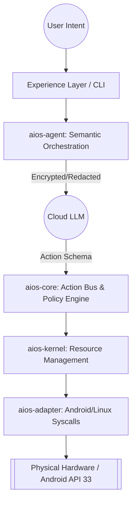

> [!IMPORTANT]
> This is a mirror of [114August514/DiPECS](https://github.com/114August514/DiPECS). Please contribute there.

# 🚀 DiPECS (Digital Intelligence Platform for Efficient Computing Systems)

<!-- Badges Area: CI Status, Rust Version, NDK Version, License -->

[](rust-toolchain.toml)
[](scripts/setup-env.sh)
[](LICENSE)

## 📖 1. 项目愿景 (Vision)

> **"The brain is in the cloud, but the reflexes must be local."**

DiPECS 是一款基于 **云端大模型驱动 (Cloud-LLM Driven)** 的下一代分布式意图操作系统原型。它通过严格的 **“机制与策略分离”**，在 Android (API 33) 物理环境下，实现用户意图感知、隐私安全脱敏、云端决策推断与本地确定性执行的高效闭环。

### 1.1 系统闭环逻辑 (System Loop)

本项目构建了一个从物理原始信号到系统预加载优化的完整状态机闭环：

1. **本地采集 (Local Collection)**: 通过 `UsageStats`、`NotificationListener` 及授权下的 `AccessibilityService` 捕获原子行为，并将其结构化为系统事件流。
2. **隐私脱敏 (Privacy Redaction)**: 在本地端通过 `aios-core` 进行隐私物理隔绝（Air-gap），确保原始数据在上传前完成敏感信息剥离。
3. **云端预测 (Cloud Prediction)**: 使用云端大模型对历史行为模式进行归纳，仅在置信度达标时输出低风险优化意图。
4. **本地优化 (Local Optimization)**: 本地内核层执行非侵入式优化（如应用进程预热、关键数据缓存），实现“零时延”感官体验。

## 🏗️ 2. 系统架构 (Architecture)

### 2.1 逻辑抽象视图

DiPECS 展现了由意图 (Intent) 降维到物理操作 (Action) 的状态机流动管道：



### 2.2 机制与策略分离设计

云端大脑主管“策略”逻辑（推演意图、结构化提取），而本地端严格聚焦“机制”（隐私清理、路由分发、硬件鉴权调用）。全系统严格遵守 `spec -> core -> kernel -> adapter` 的单向不可逆依赖栈流，拒绝越级抽象。

## 📦 3. 车间布局 (Project Structure / Workspace)

| Crate | 层级 | 职责 | 技术栈 |
| :--- | :--- | :--- | :--- |
| **`aios-spec`** | **宪法层** | 系统 SSOT。定义数据结构、Trait 及 Action Schema。 | `prost` (PB), `serde` |
| **`aios-core`** | **逻辑层** | 枢纽。统筹调度、**Privacy Air-gap** 与防渗漏审计。 | `tracing`, `thiserror` |
| **`aios-kernel`** | **内核层** | 控制底层资源生命周期、任务时序分配与 IPC 协同。 | `tokio`, `libc` |
| **`aios-adapter`** | **适配层** | 跨接物理世界。代理 Android Binder 与 Linux Syscalls。 | `jni`, `ndk-sys` |
| **`aios-agent`** | **业务层** | LLM 大脑本地 Proxy。执行语义编组与对话轮次控制。 | `async-trait` |
| **`aios-cli`** | **工具层** | 交互沙盒与系统状态的“显微镜”探针 (TUI)。 | `ratatui` |

## 🛠️ 4. 技术栈说明 (Tech Stack)

### 4.1 核心基石

- **语言**: Rust 1.86.0 (Stable)，强制 `Resolver v2`。
- **Android 集成**: NDK r27d, API Level 33 (Android 13)。
- **可观测性**: `tracing` (异步全链路追踪), `tracing-subscriber`。
- **异步处理**: `tokio` (全功能运行时)。
- **错误处理**: `thiserror` (强类型库错误) / `anyhow` (应用层)。

### 4.2 开发哲学

- **Safe Rust**: 严禁隐式 `unwrap()`/`expect()`。
- **No-alloc 倾向**: 在 `core` 热路径中优先考虑栈分配，减少堆垃圾回收抖动。
- **单向依赖**: 严格遵守 `spec -> core -> kernel -> adapter` 拓扑。

## 🛠️ 5. 环境引导与自举 (Bootstrap & Toolchain)

针对跨 Android/Linux AArch64 繁琐的配置，架构组通过自动化脚本抹平了环境门槛。

### 4.1 预备环境 (Prerequisites)

一台类 Unix 系统机器，依赖原生编译宿主环境。

### 4.2 一键初始化 (Setup)

注入 Rust 1.86.0 与预编译的 Android NDK (r27d) 环境：

```bash
source scripts/setup-env.sh
```

### 4.3 交叉编译与部署 (Cross-Compilation & Deploy)

```bash
# 对 AArch64 Android 环境生产构建
cargo android-release

# 推送临时产物至 Android 设备 (/data/local/tmp) 并挂载执行
./scripts/android-runner.sh
```

## 🤖 5. AI 协作协议 (The PIP Protocol v2.1)

本项目引入高度特化的内建大模型开发流水线。无论是人类 Dev 还是 AI Agent，必须遵从 **`.github/copilot-instructions.md`** 中的 **“三轮迭代状态机 (Triple-Turn PIP Protocol)”** 指导闭环开发。

### 5.1 三轮迭代状态机

- **🟦 1. [Plan] 架构审计**：识别需求 Intent，绘制核心 State Transition 边界，拦截不合理的单向物理层穿透。通过 `GO` 获准推进。
- **🟩 2. [Implementation] 确定性编码**：0 Panic 容忍（禁 `unwrap/expect`），必须抛出强类型 `thiserror` 错误，注入 Trace 观测点。以 `TEST` 作为检验放行标准。
- **🟥 3. [Proof] 物理验证**：终端真实触发离线轨迹或 Cargo 单元拦截测试作为强力验证锚点。

### 5.2 隐式观测规则

**"无观测不设计" (⬛ [Observe] 阶段)**。禁止盲目脑部猜想上下文拓扑配置。一切架构干涉与实现重构前，要求必定进行工具静默查探。

## 📚 6. 双轨知识库 (Documentation)

团队维持极度苛刻的双轨并行知识基操，覆盖敏捷协作与院系报备双向要求：

- **📖 工程指南 (mdBook)**: `docs/src/`。供项目组共享 RFC 提案、API 文档以及系统的状态转移模型图 (`architecture/states.md`)。
- **🎓 学术报告 (LaTeX)**: `docs/academic/`。承载科研产出，从早期的课题可行性探讨 (`Survey`) 到中后期汇报自动化出刊体系。

## 🧪 7. 质量堡垒与可观测性 (CI/CD & Observability)

> **"No observation, no debugging."**

*通过 `public/index.html` 访问自动生成的全量系统视图（包含实时更新的状态转移图与 API 拓扑）。*

### 7.1 本地守卫 (Git Hooks)

所有 Push 前需历经大满贯本地筛查防线：

```bash
# 包含 fmt, clippy (零警告拦截), cargo tests 及基于 android target 交叉编译回归查验。
./scripts/check-all.sh
```

### 7.2 云端离线流水线 (Data Traces)

**任何 Logic Layer 的变更必须通过 Golden Traces 的 0 偏差校验（State Machine Replication）。**

使用 `data/traces/` 重建并固化物理世界的历史态调用流。当脱离 Android 真机或处于远端部署沙箱时，借助 `aios-adapter` 预装的 `OfflineAdapter` 进行确定性重放检验语义回归程度。

### 7.3 物理指标审计 (Bloat & Bench)

合流前必须审计的系统剖面：

- **体积 (bloat)**: 限制核心依赖的重型膨胀 (`deny.toml`)。
- **轨迹 (tracing)**: 将涉及文件 I/O、Action 派发调用的异步流精准挂载入微秒级拓扑监控图层中。

## 🤝 8. 贡献指南 (Contributing)

参与合并请遵循 [**CONTRIBUTING.md**](CONTRIBUTING.md)。基本素养：**Issue First** 且 严格践行 **PIP 协议回流机制**。

## 📜 9. 许可证 (License)

采用开放的 [**Apache License 2.0**](LICENSE) 授权发行。
