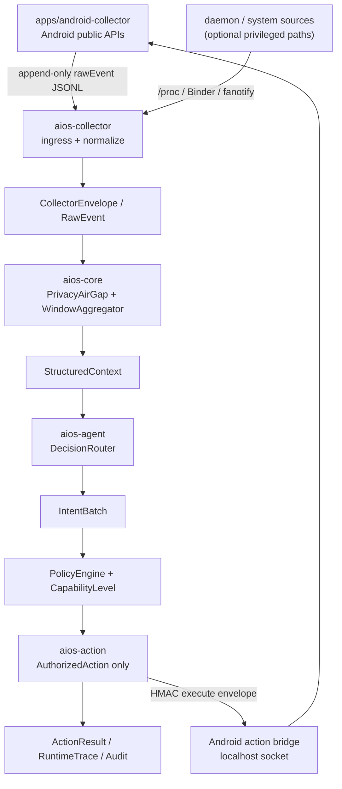

# DiPECS

<div align="center">

### A local-first Android AIOS prototype for measurable resource-action benefits

[English](README.md) | [简体中文](README.zh-CN.md)

[](rust-toolchain.toml)
[](apps/android-collector/app/build.gradle.kts)
[](scripts/setup-env.sh)
[](LICENSE)

</div>

DiPECS (Digital Intelligence Platform for Efficient Computing Systems) explores
how an Android-side AIOS prototype can turn local context into measured resource
actions without turning the model into an unchecked controller.

The project value is not privacy alone. Privacy, policy, authorization, and
audit are the guardrails that make it acceptable to execute resource actions.
The benefit claim must come from measured latency, I/O, memory, or device-side
behavior improvements on Android.

**Documentation site:** [114august514.github.io/DiPECS](https://114august514.github.io/DiPECS/)

## Why DiPECS?

AIOS-style systems are often described as "AI agents that understand and operate
the device." That framing is useful, but it hides the hard engineering questions:

- What local signals can be collected without leaking private raw data?
- What context is safe enough for model-facing decision backends?
- How does a candidate model decision become an authorized system action?
- Which actions produce measurable benefit on a real Android device?
- How can every decision and action be replayed, audited, and rejected safely?

DiPECS is built to answer those questions as a research prototype, not as an
unbounded assistant. It provides a complete local control loop and the evaluation
tools needed to test that loop.

## Highlights

- **Measured Android resource actions**: Pixel 6a experiments cover
  PreWarmProcess, PrefetchFile, and ReleaseMemory `cache:volatile` with n>=20
  action-benefit gates.
- **Privacy air-gap**: raw Android events are sanitized before model-facing
  context is built.
- **Structured context windows**: local events are aggregated into bounded
  `StructuredContext` records for replayable decision making.
- **Pluggable decisions**: rule-based, local evaluator, cloud LLM, and fallback
  backends share the same `IntentBatch` contract.
- **Policy-before-action execution**: `PolicyEngine` and `ActionLifecycle` seal
  an `AuthorizedAction` before execution is possible.
- **Authenticated Android bridge**: Android actions use a localhost socket,
  HMAC-SHA256 execute envelopes, short freshness windows, and
  `EncryptedSharedPreferences` token storage.
- **Evidence-first evaluation**: action claims are backed by Pixel 6a real-device
  measurements or marked as out of scope.

## How It Works



The runtime loop has six boundaries:

1. **Sense** Android-local signals from public APIs, `/proc`, and optional
   privileged routes.
2. **Sanitize** raw events through `PrivacyAirGap`.
3. **Aggregate** events into bounded `StructuredContext` windows.
4. **Decide** through rule-based, local-evaluator, cloud LLM, or fallback
   backends.
5. **Authorize** proposed actions through `PolicyEngine` and `ActionLifecycle`.
6. **Execute and audit** Android-safe actions through the authenticated bridge
   and replayable runtime records.

## Design Principles

- **Local-first by default**: local collection and replay should work without a
  cloud model in the loop.
- **Raw data stops early**: `RawEvent` ends at `PrivacyAirGap`; model backends
  consume `StructuredContext` / `ModelInput`.
- **Models propose, policy disposes**: decision backends emit `IntentBatch`;
  local policy decides whether anything can execute.
- **Actions are sealed artifacts**: executable actions must be represented as
  `AuthorizedAction`, not ad hoc model text.
- **Evidence is scoped**: a successful dispatch chain is not treated as a
  benefit claim unless real measurements support it.

## Main Components

| Component | Role |
| :--- | :--- |
| `aios-spec` | Shared protocol types such as `RawEvent`, `CollectorEnvelope`, `SanitizedEvent`, `StructuredContext`, `IntentBatch`, `CapabilityLevel`, and action data. |
| `aios-core` | Privacy sanitization, window aggregation, policy review, model memory, golden trace replay, and `AuthorizedAction` lifecycle sealing. |
| `aios-agent` | Rule-based, local evaluator, cloud LLM, and fallback decision backends. |
| `aios-action` | Authorized action execution and Android bridge forwarding. |
| `apps/android-collector` | Android public-API collector, action socket, and device-side action outcome recorder. |
| `aios-daemon` | Long-lived runtime pipeline. |
| `aios-cli` | Replay, audit, next-app evaluation, and action socket tooling. |

## Research Evidence

| Capability | Evidence | What it demonstrates |
| :--- | :--- | :--- |
| Privacy boundary | `PrivacyAirGap` regression tests keep raw text and sensitive fields out of model inputs. | Model-facing context can be built without passing through original notification text or private raw fields. |
| Action governance | `PolicyEngine` and `ActionLifecycle` seal `AuthorizedAction` before `aios-action` can execute. | Decision backends propose intents; execution requires local policy approval. |
| PreWarmProcess `own:*` | Pixel 6a n=20/mode: cold mean/p95 `710.75/733 ms`, prewarm-hit `201.55/213 ms`; DiPECS net benefit `76,068,875.158 ms` > strong baseline `72,283,770.198 ms`. | Android-safe own-resource prewarm can produce positive action-level value. |
| PrefetchFile | Pixel 6a n=20/mode: prefetched read mean/p95 `79.993/101.332 ms`, miss fetch+read `1860.332/2276.297 ms`; DiPECS projected net benefit beats strong baseline. | File prefetch can avoid later download/read wait when the prediction hits. |
| ReleaseMemory `cache:volatile` | Pixel 6a true pressure run: available-memory gain `+55,158.6 KB`, PSS reduction gain `+64,621.3 KB`, Welch p-value `0.00026891`. | App-owned volatile memory can be released under pressure and measured directly. |

Detailed scope limits and negative results are documented in
[action-benefit coverage](docs/src/evaluation/action-benefit-coverage.md) and
the final report sources.

## Quick Start

Run Rust checks:

```bash
cargo fmt --all -- --check
cargo clippy --workspace --all-targets --all-features -- -D warnings
cargo test --workspace
```

Run the daemon:

```bash
RUST_LOG=info cargo run -p aios-daemon --bin dipecsd -- --no-daemon
```

Run daemon with Android JSONL ingress:

```bash
RUST_LOG=info cargo run -p aios-daemon --bin dipecsd -- \
  --no-daemon \
  --android-trace-jsonl apps/android-collector/actions.jsonl \
  --trace-output data/evaluation/runtime.ndjson
```

Replay a trace:

```bash
cargo run -p aios-cli -- replay data/traces/sample_replay.jsonl \
  --stages policy \
  --audit data/evaluation/audit.ndjson
```

Build docs:

```bash
cd docs
uv sync --frozen
uv run env PYTHONPATH=. mkdocs build
```

Build the Android collector:

```bash
cd apps/android-collector
./gradlew :app:assembleDebug
```

Prepare LSApp for next-app evaluation:

```bash
git submodule update --init third_party/LSApp
bash tools/prepare-lsapp.sh
```

## Android Action Bridge

Enable direct forwarding from `aios-action` to Android:

```bash
DIPECS_ANDROID_ACTION_BRIDGE_ENABLED=true
DIPECS_ANDROID_ACTION_BRIDGE_HOST=127.0.0.1
DIPECS_ANDROID_ACTION_BRIDGE_PORT=46321
DIPECS_ANDROID_ACTION_BRIDGE_TOKEN=dipecs-dev-emulator-shared-token-00000000
```

Android Studio debug builds use `dipecs-dev-emulator-shared-token-00000000` on
first launch unless an adb property overrides it:

```bash
adb shell setprop debug.dipecs.token my-local-debug-token
adb shell pm clear com.dipecs.collector
```

Release builds generate a random token in `EncryptedSharedPreferences`; copy it
from the app before release validation.

## Repository Map

| Path | Purpose |
| :--- | :--- |
| `crates/aios-spec` | Cross-crate protocol, data model, and traits. |
| `crates/aios-collector` | Rust collector ingress and Android JSONL tailer. |
| `crates/aios-core` | Privacy air-gap, aggregation, policy, replay validation. |
| `crates/aios-agent` | Decision routing and rule/cloud/fallback backends. |
| `crates/aios-action` | Authorized action execution and Android bridge forwarding. |
| `crates/aios-daemon` | `dipecsd` runtime pipeline. |
| `crates/aios-cli` | Replay, audit, next-app evaluation, and socket tooling. |
| `apps/android-collector` | Android public-API collector and action bridge. |
| `tests` | Integration tests and Android end-to-end scenarios. |
| `tools` | Evaluation, collection, and synthetic trace utilities. |
| `third_party` | External research datasets/projects used by evaluation. |
| `docs/src` | MkDocs Material documentation. |
| `docs/academic-src` | Academic report sources. |

## Contributors

Commit-count share from the GitHub contributors stats API for the project period
`2026-03-29` through `2026-07-05`. Bot-like accounts are excluded. GitHub's
stats endpoint follows default-branch contributor attribution and does not offer
path-level filtering, so local `git shortlog` author aliases may differ.

| Contributor | Commits | Share |
| :--- | ---: | ---: |
| August / 114August514 | 125 | 60.7% |
| Xinzhe Wang / gold3fluoride | 35 | 17.0% |
| Li siyuan / KevinDb123 | 25 | 12.1% |
| Mirawind / 50829 | 9 | 4.4% |
| Unlinked Git author | 7 | 3.4% |
| SHRroger | 5 | 2.4% |

This is a commit-count view, not a line-count, ownership, or review-effort
metric.

## Documentation and Contributing

- Published documentation site: [114august514.github.io/DiPECS](https://114august514.github.io/DiPECS/)
- Documentation site sources: [docs/src](docs/src)
- Final report source: [docs/academic-src/04_Final_Report](docs/academic-src/04_Final_Report)
- Changelog: [CHANGELOG.md](CHANGELOG.md)
- Contribution guide: [CONTRIBUTING.md](CONTRIBUTING.md) / [简体中文](CONTRIBUTING.zh-CN.md)

## License

DiPECS is licensed under the [Apache License 2.0](LICENSE).
