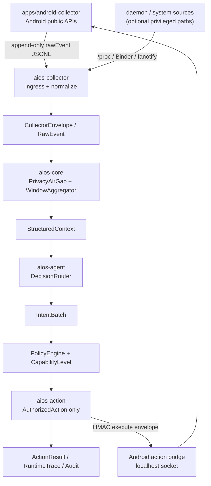

# DiPECS

<div align="center">

### 面向 Android 的本地优先 AIOS 资源动作原型

[English](README.md) | [简体中文](README.zh-CN.md)

[](rust-toolchain.toml)
[](apps/android-collector/app/build.gradle.kts)
[](scripts/setup-env.sh)
[](LICENSE)

</div>

DiPECS（Digital Intelligence Platform for Efficient Computing Systems）探索的是：
Android 端侧 AIOS 原型怎样把本地上下文转化为可测的资源动作，同时又不让模型变成不受
约束的系统控制器。

项目价值不是“有隐私保护”本身。隐私、策略、授权和审计是动作能安全进入系统前必须有
的边界；真正的收益必须落到 Android 设备上的延迟、I/O、内存或用户可感知表现改善。

## 为什么需要 DiPECS？

AIOS 式系统常被描述为“理解并操作设备的 AI agent”。这个方向很有价值，但它也隐藏了
几个关键工程问题：

- 哪些本地信号可以采集，同时不泄露私有原始数据？
- 什么样的上下文足够安全，可以交给模型侧决策后端？
- 模型候选决策怎样变成一个被授权的系统动作？
- 哪些动作在真实 Android 设备上确实能产生可测收益？
- 每一次决策和动作怎样被回放、审计，并在不安全时被拒绝？

DiPECS 是为了回答这些问题而做的研究原型，而不是一个无边界的助手。它提供完整的本地
控制闭环，也提供验证这条闭环的评估工具。

## 项目亮点

- **可测 Android 资源动作**：Pixel 6a 实验覆盖 PreWarmProcess、PrefetchFile 和
  ReleaseMemory `cache:volatile`，均有 n>=20 动作收益 gate。
- **隐私气隙**：Android 原始事件先脱敏，再进入模型侧上下文。
- **结构化上下文窗口**：本地事件被聚合成有边界、可回放的 `StructuredContext`。
- **可插拔决策后端**：规则、本地评估器、云端 LLM 和 fallback 后端共享同一个
  `IntentBatch` 合约。
- **先策略、后动作**：`PolicyEngine` 和 `ActionLifecycle` seal `AuthorizedAction` 后，
  动作才可能执行。
- **带认证的 Android bridge**：Android 动作使用 localhost socket、HMAC-SHA256 execute
  envelope、短 freshness window 和 `EncryptedSharedPreferences` token 存储。
- **证据优先的评估**：动作收益必须有 Pixel 6a 真机测量支撑，否则只保留为适用范围或
  负面结果。

## 工作方式



运行时闭环有六层边界：

1. **感知**：从 Android public API、`/proc` 和可选高权限路径读取 Android 本地信号。
2. **脱敏**：原始事件先经过 `PrivacyAirGap`。
3. **聚合**：事件被压成有边界的 `StructuredContext` 时间窗口。
4. **决策**：规则、本地评估器、云端 LLM 或 fallback 后端生成候选意图。
5. **授权**：候选动作经过 `PolicyEngine` 和 `ActionLifecycle`。
6. **执行与审计**：Android-safe 动作通过带认证的 bridge 执行，并留下可回放运行时记录。

## 设计原则

- **默认本地优先**：即使没有云端模型，本地采集和 replay 也应该可运行。
- **原始数据尽早停止**：`RawEvent` 止步于 `PrivacyAirGap`；模型后端消费
  `StructuredContext` / `ModelInput`。
- **模型只提议，策略来裁决**：决策后端输出 `IntentBatch`；是否执行由本地策略决定。
- **动作必须是 sealed artifact**：可执行动作必须表示为 `AuthorizedAction`，不能是随意的
  模型文本。
- **证据需要限定范围**：动作链路能发通不等于有收益；收益结论必须由真实测量支撑。

## 主要组件

| 组件 | 角色 |
| :--- | :--- |
| `aios-spec` | 跨 crate 协议类型，例如 `RawEvent`、`CollectorEnvelope`、`SanitizedEvent`、`StructuredContext`、`IntentBatch`、`CapabilityLevel` 和动作数据。 |
| `aios-core` | 隐私脱敏、窗口聚合、策略审查、模型记忆、golden trace replay 和 `AuthorizedAction` 生命周期 seal。 |
| `aios-agent` | 规则、本地评估器、云端 LLM 和 fallback 决策后端。 |
| `aios-action` | 授权动作执行和 Android bridge 转发。 |
| `apps/android-collector` | Android public API 采集器、action socket 和设备侧动作结果记录。 |
| `aios-daemon` | 常驻运行时管线。 |
| `aios-cli` | Replay、audit、next-app 评估和 action socket 工具。 |

## 研究证据

| 能力 | 证据 | 说明 |
| :--- | :--- | :--- |
| 隐私边界 | `PrivacyAirGap` 回归测试确保原始文本和敏感字段不进入模型输入。 | 模型侧上下文可以不携带通知正文和私有原始字段。 |
| 动作治理 | `PolicyEngine` 和 `ActionLifecycle` 在 `aios-action` 执行前 sealed `AuthorizedAction`。 | 决策后端只提议意图，执行必须经过本地策略。 |
| `PreWarmProcess own:*` | Pixel 6a n=20/mode：cold mean/p95 `710.75/733 ms`，prewarm-hit `201.55/213 ms`；DiPECS 净收益 `76,068,875.158 ms` > strong baseline `72,283,770.198 ms`。 | Android-safe 自有资源预热能产生正向动作级价值。 |
| `PrefetchFile` | Pixel 6a n=20/mode：prefetched read mean/p95 `79.993/101.332 ms`，miss fetch+read `1860.332/2276.297 ms`；DiPECS projected net benefit 高于 strong baseline。 | 预测命中时，文件预取能避免后续下载/读取等待。 |
| `ReleaseMemory cache:volatile` | Pixel 6a 真压力：available-memory gain `+55,158.6 KB`，PSS reduction gain `+64,621.3 KB`，Welch p-value `0.00026891`。 | app-owned volatile memory 可以在压力下释放并被直接测量。 |

详细适用范围和负面结果见
[动作收益覆盖](docs/src/evaluation/action-benefit-coverage.md) 和结题报告源码。

## 快速开始

运行 Rust 检查：

```bash
cargo fmt --all -- --check
cargo clippy --workspace --all-targets --all-features -- -D warnings
cargo test --workspace
```

运行 daemon：

```bash
RUST_LOG=info cargo run -p aios-daemon --bin dipecsd -- --no-daemon
```

用 Android JSONL 入口运行 daemon：

```bash
RUST_LOG=info cargo run -p aios-daemon --bin dipecsd -- \
  --no-daemon \
  --android-trace-jsonl apps/android-collector/actions.jsonl \
  --trace-output data/evaluation/runtime.ndjson
```

回放 trace：

```bash
cargo run -p aios-cli -- replay data/traces/sample_replay.jsonl \
  --stages policy \
  --audit data/evaluation/audit.ndjson
```

构建文档：

```bash
cd docs
uv sync --frozen
uv run env PYTHONPATH=. mkdocs build
```

构建 Android collector：

```bash
cd apps/android-collector
./gradlew :app:assembleDebug
```

准备 LSApp 评估数据：

```bash
git submodule update --init third_party/LSApp
bash tools/prepare-lsapp.sh
```

## Android Action Bridge

启用 `aios-action` 到 Android 的直连转发：

```bash
DIPECS_ANDROID_ACTION_BRIDGE_ENABLED=true
DIPECS_ANDROID_ACTION_BRIDGE_HOST=127.0.0.1
DIPECS_ANDROID_ACTION_BRIDGE_PORT=46321
DIPECS_ANDROID_ACTION_BRIDGE_TOKEN=dipecs-dev-emulator-shared-token-00000000
```

Android Studio debug build 首次启动默认使用 `dipecs-dev-emulator-shared-token-00000000`，
也可用 adb property 覆盖：

```bash
adb shell setprop debug.dipecs.token my-local-debug-token
adb shell pm clear com.dipecs.collector
```

Release build 会在 `EncryptedSharedPreferences` 中生成随机 token，release 验证前需要从 app 中复制。

## 仓库结构

| 路径 | 用途 |
| :--- | :--- |
| `crates/aios-spec` | 跨 crate 协议、数据模型和 trait。 |
| `crates/aios-collector` | Rust 采集入口和 Android JSONL tailer。 |
| `crates/aios-core` | 隐私气隙、聚合、策略和 replay 验证。 |
| `crates/aios-agent` | 决策路由和规则/云端/fallback 后端。 |
| `crates/aios-action` | 授权动作执行和 Android bridge 转发。 |
| `crates/aios-daemon` | `dipecsd` 运行时管线。 |
| `crates/aios-cli` | Replay、audit、next-app 评估和 socket 工具。 |
| `apps/android-collector` | Android public-API collector 和 action bridge。 |
| `tests` | 集成测试和 Android 端到端场景。 |
| `tools` | 评估、采集和合成 trace 工具。 |
| `third_party` | 评估使用的外部研究数据/项目。 |
| `docs/src` | MkDocs Material 文档。 |
| `docs/academic-src` | 学术报告源码。 |

## 贡献者

以下是 GitHub contributors stats API 在项目周期 `2026-03-29` 到 `2026-07-05`
内的 commit-count 占比。bot-like 账号已排除。GitHub stats endpoint 使用默认分支的
contributors 归因口径，且不提供按路径过滤；因此本地 `git shortlog` 的 author alias
可能与这里不同。

| 贡献者 | Commits | 占比 |
| :--- | ---: | ---: |
| August / 114August514 | 125 | 60.7% |
| Xinzhe Wang / gold3fluoride | 35 | 17.0% |
| Li siyuan / KevinDb123 | 25 | 12.1% |
| Mirawind / 50829 | 9 | 4.4% |
| 未绑定 GitHub 的 Git author | 7 | 3.4% |
| SHRroger | 5 | 2.4% |

这只是 commit 数占比，不代表代码行数、所有权或 review 工作量。

## 文档与贡献

- 文档源码：[docs/src](docs/src)
- 结题报告源码：[docs/academic-src/04_Final_Report](docs/academic-src/04_Final_Report)
- 更新日志：[CHANGELOG.md](CHANGELOG.md)
- 贡献指南：[CONTRIBUTING.md](CONTRIBUTING.md) / [简体中文](CONTRIBUTING.zh-CN.md)

## License

DiPECS 使用 [Apache License 2.0](LICENSE)。
