---
theme: seriph
title: DiPECS — 云-端协同的分布式意图操作系统
info: |
  DiPECS v0.3 中期报告
class: text-center
transition: slide-left
duration: 35min
---

# DiPECS

## 云-端协同的分布式意图操作系统

Digital Intelligence Platform for Efficient Computing Systems

<div class="pt-12">
  <span class="text-sm opacity-50">v0.3 · 2026.05</span>
</div>

---

# 项目概述

<div class="grid grid-cols-2 gap-4 mt-4 text-sm">

<div>

### 基本信息

- **全称**: Digital Intelligence Platform for Efficient Computing Systems
- **定位**: Cloud-LLM 驱动的分布式意图操作系统原型
- **运行平台**: Android API 33 (AOSP)
- **当前版本**: v0.3 (2026.05)
- **许可证**: Apache 2.0

</div>

<div>

### 技术栈

- **语言**: Rust 1.95.0 (Stable)
- **异步运行时**: tokio (mpsc / broadcast / time)
- **可观测性**: tracing + tracing-subscriber
- **编译目标**: `x86_64-linux-gnu` / `aarch64-linux-android`
- **NDK**: r27d · Android API 33

</div>

</div>

<div class="grid grid-cols-3 gap-3 mt-4 text-center text-sm">

<div class="p-2 border border-primary/20 rounded">
  <div class="text-lg font-bold">6</div>
  <div class="opacity-60">Crates</div>
</div>

<div class="p-2 border border-primary/20 rounded">
  <div class="text-lg font-bold">62</div>
  <div class="opacity-60">Tests (all pass)</div>
</div>

<div class="p-2 border border-primary/20 rounded">
  <div class="text-lg font-bold">~4,300</div>
  <div class="opacity-60">Lines of Rust</div>
</div>

</div>

<div class="mt-4 text-center text-sm opacity-75">
  "The brain is in the cloud, but the reflexes must be local."
</div>

---

# 一、What — 结构化信号从哪里来

**8 种采集源 → 8 种 RawEvent 变体**。所有信号在 Android/Linux 内核及系统服务层面采集，不经过 App 层：

<div class="grid grid-cols-2 gap-2 mt-2 text-xs w-full px-0">

<div>

| 采集源 | 采集方式 | 对应 RawEvent |
| :--- | :--- | :--- |
| 应用切换 | UsageStatsManager | `AppTransition` |
| Binder 事务 | eBPF tracepoint | `BinderTransaction` |
| /proc 文件系统 | 每 100ms 轮询差分 | `ProcStateChange` |
| 文件系统访问 | fanotify | `FileSystemAccess` |
| 通知到达 | NotificationListenerService | `NotificationPosted` |

</div>

<div>

| 采集源 | 采集方式 | 对应 RawEvent |
| :--- | :--- | :--- |
| 通知交互 | NotificationListenerService | `NotificationInteraction` |
| 屏幕状态 | `/sys/class/drm` | `ScreenState` |
| 系统状态 | `/sys/class/power_supply` 等 | `SystemState` |

<div class="mt-2 p-2 bg-primary/10 rounded text-xs">

**采集粒度**: /proc + Binder 每 100ms，系统状态每 30s。  
**差分优化**: ProcReader 仅推送状态变化的进程，静默跳过未变化者。

</div>

</div>

</div>

<v-click>

<div class="mt-2 text-sm opacity-75">

> 这些信号经过 `aios-collector` 采集、封装为 `RawEvent`，通过 `tokio::mpsc` 推入 `aios-core`，然后在 `PrivacyAirGap` 处完成脱敏。

</div>

</v-click>

---

# What · 信号如何定义 — RawEvent → SanitizedEvent

<div class="grid grid-cols-2 gap-4 mt-1 text-sm">

<div>

### RawEvent (8 variants, 含 PII)

```rust
pub enum RawEvent {
    AppTransition(AppTransitionRawEvent), // package, activity, foreground/background
    BinderTransaction(BinderTxEvent),     // service + method + payload_size
    ProcStateChange(ProcStateEvent),       // pid, rss, swap, oom_score, threads
    FileSystemAccess(FsAccessEvent),       // file_path ⚠️, extension, access_type
    NotificationPosted(NotificationRawEvent),  // raw_title ⚠️, raw_text ⚠️
    NotificationInteraction(NotificationInteractionRawEvent),
    ScreenState(ScreenStateEvent),
    SystemState(SystemStateEvent),         // battery, network, ringer_mode
}
```

<div class="mt-2 text-xs opacity-60">⚠️ = 含 PII, 仅存在于 collector→core 的 mpsc 通道中</div>

</div>

<div>

### SanitizedEvent (7 variants, 零 PII)

```rust
pub enum SanitizedEventType {
    AppTransition {         // 从前台 App 推断
        package_name, activity_class, transition
    },
    InterAppInteraction {   // 从 Binder 推断
        source_package, target_service, interaction_type
    },
    Notification {          // 正文已脱敏
        title_hint: TextHint, text_hint: TextHint,
        semantic_hints: Vec<SemanticHint>
    },
    ProcessResource { pid, vm_rss_mb, oom_score, ... },
    FileActivity { extension_category, is_hot_file, ... },
    Screen { state },
    SystemStatus { battery_pct, network, ... },
}
```

</div>

</div>

---

# What · 脱敏辅助类型体系

信号从"含 PII 的原始字符串"到"结构化语义标签"的转化链：

<div class="grid grid-cols-3 gap-3 mt-2 text-sm">

<div>

### TextHint

通知文本的**形态特征**，不含内容：

- `length_chars` — 字符数
- `script` — Latin / Hanzi / Cyrillic / Arabic / Mixed / Unknown
- `is_emoji_only` — 是否纯 emoji

</div>

<div>

### SemanticHint

**本地关键词匹配** (中英双语)，不传云端：

- FileMention / ImageMention
- AudioMessage / LinkAttachment
- UserMentioned / CalendarInvitation
- FinancialContext / VerificationCode

</div>

<div>

### ExtensionCategory

文件路径→仅保留**扩展名分类**：

- Document (pdf, docx, txt...)
- Image / Video / Audio
- Archive (zip, rar...)
- Code (apk, py, rs...)
- Other / Unknown

</div>

</div>

<v-click>

<div class="mt-3 p-3 border border-primary/20 rounded text-sm">

**设计原则**: 所有语义提取在本地完成。云端 LLM 只收到 `TextHint` + `SemanticHint` + `ExtensionCategory` 的组合，永远收不到原始字符串。Rust ownership 在 `sanitize()` 后物理丢弃原始数据。

</div>

</v-click>

---

# What · 项目范围与当前进度

**当前版本 v0.3** — 端到端处理管道已完全打通，新增 Android 端本地采集探针

<div class="grid grid-cols-2 gap-4 mt-4">

<div>

已完成模块 (7 个):

- `aios-spec` 宪法层 · 全部数据类型 (含 AppTransition)
- `aios-core` 逻辑层 · 事件总线 / 脱敏 / 策略 / 上下文聚合
- `aios-collector` 采集层 · /proc / eBPF / 系统状态 / CollectionStats 采集
- `aios-action` 动作层 · 动作执行骨架
- `aios-agent` 决策层 · DecisionRouter / MockCloudProxy
- `aios-daemon` 编排层 · dipecsd 主循环
- `apps/android-collector` · Kotlin Android public-API bridge (production JSONL ingress + optional screening)
- 62 个测试 · 全部通过

</div>

<div>

当前已推进:

- Cloud LLM HTTPS 真实通信 (DeepSeek / Qwen / OpenAI-compatible)
- Android public-API JSONL 生产入口
- RuntimeTraceRecorder 与 CI replay/audit artifact
- Android action bridge token 鉴权与 `PrefetchFile(url:/uri:)` 转发

仍需完成:

- 更多 Android-safe 真实动作
- Fanotify 文件监控
- Android 真机端到端验证

</div>

</div>

---

# What · Android public-API bridge — `apps/android-collector`

**Kotlin Android 应用** — 在设备上直接采集行为信号，支持逐个数据源的接口筛选

### 4 个数据源

| 数据源 | 实现方式 | 采集事件 |
| :--- | :--- | :--- |
| 应用使用 | `UsageStatsManager` | 前台 App 切换 (→ `AppTransition`) |
| 通知 | `NotificationListenerService` | 通知发布/移除 (→ `NotificationPosted`) |
| 无障碍 | `AccessibilityService` | 窗口、点击、焦点、文本变化 |
| 设备上下文 | 系统 API 查询 | 电量、网络、屏幕、铃声、DND |

---

# What · Android public-API bridge — 关键特性

### 关键特性

- **Source Toggle**: 主界面逐一开关每个数据源，production ingress / screening 工作流
- **JSONL 存储**: 事件写入 `<files>/traces/actions.jsonl`
- **云端上传**: mock / llm 双模式，周期性上传最近 100 条事件
- **RawEvent 对齐**: 每条 JSONL 事件的 `rawEvent` 字段使用和 `aios-spec::RawEvent` 一致的 JSON 格式
- **CI**: GitHub Actions 自动构建 debug APK + 单元测试 + 产物上传

<div v-click class="mt-4 p-3 border border-primary/20 rounded text-sm">

**与 Rust daemon 的关系**: android-collector 是 Android public-API bridge：UsageStats、NotificationListener 和 DeviceContext 已通过 `rawEvent` JSONL 进入 Rust daemon/core；Accessibility 等未建模来源继续作为筛选增强。daemon 仍负责 Rust 侧 envelope、脱敏、聚合、决策和策略审查。

</div>

---

# What · Android public-API bridge — `apps/android-collector`

**Kotlin Android 应用** — 在设备上直接采集行为信号，支持逐个数据源的接口筛选

<div class="grid grid-cols-2 gap-4 mt-4 text-sm">

<div>

### 4 个数据源

| 数据源 | 实现方式 | 采集事件 |
| :--- | :--- | :--- |
| 应用使用 | `UsageStatsManager` | 前台 App 切换 (→ `AppTransition`) |
| 通知 | `NotificationListenerService` | 通知发布/移除 (→ `NotificationPosted`) |
| 无障碍 | `AccessibilityService` | 窗口、点击、焦点、文本变化 |
| 设备上下文 | 系统 API 查询 | 电量、网络、屏幕、铃声、DND |

---

# What · Android public-API bridge — 关键特性

### 关键特性

- **Source Toggle**: 主界面逐一开关每个数据源，production ingress / screening 工作流
- **JSONL 存储**: 事件写入 `<files>/traces/actions.jsonl`
- **云端上传**: mock / llm 双模式，周期性上传最近 100 条事件
- **RawEvent 对齐**: 每条 JSONL 事件的 `rawEvent` 字段使用和 `aios-spec::RawEvent` 一致的 JSON 格式
- **CI**: GitHub Actions 自动构建 debug APK + 单元测试 + 产物上传

<div v-click class="mt-4 p-3 border border-primary/20 rounded text-sm">

**与 Rust daemon 的关系**: android-collector 是 Android public-API bridge：UsageStats、NotificationListener 和 DeviceContext 已通过 `rawEvent` JSONL 进入 Rust daemon/core；Accessibility 等未建模来源继续作为筛选增强。daemon 仍负责 Rust 侧 envelope、脱敏、聚合、决策和策略审查。

</div>

---

# 二、Why — 为什么要做 DiPECS

<v-clicks>

## 问题一: 传统 OS 是被动的

- Android/Linux 的调度器只能对**已发生**的事件做出反应
- 用户的"打开 App"操作发生在点击之后，OS 才开始 fork zygote → 加载 dex → 渲染首帧
- **结果**: 冷启动延时 300ms-3s，取决于 App 体积和设备负载

## 问题二: 传统 OS 缺少隐私原语

- 现有方案 (如 Google Now / Siri 建议) 直接在 App 层收集原始数据上传
- 通知正文、文件路径、Binder 参数一览无余
- **结果**: 用户必须信任厂商，没有验证手段

</v-clicks>

---

# Why · 为什么不在现有 OS 上叠加 AI

<v-clicks>

**"叠加"方案的三个致命缺陷:**

1. **隐私失控**: AI 助手作为 App 运行，能读到通知、屏幕内容、剪贴板 → 原生 API 无脱敏概念 → 数据"全量外传"
2. **不可验证**: 助手输出是自然语言指令 → 无结构化 Schema → 无法做确定性回归测试
3. **耦合脆弱**: 助手和 App 生命周期绑定 → 被 LMK 杀掉 → 预测链路断裂

**DiPECS 的做法:**

- 作为 **系统级守护进程** (`dipecsd`)，不受 App 生命周期限制
- 在 **原始数据产生处** 就地脱敏 (daemon 内部，内存中)
- 云端只返回 **结构化 Intent/Action**，不输出自然语言指令

</v-clicks>

---

# Why · 设计哲学与选型

<div class="grid grid-cols-2 gap-4 mt-2 text-sm">

<div>

### 机制-策略分离

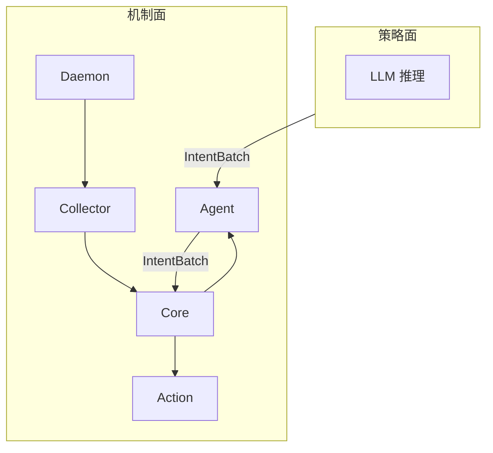

> 云端决定"做什么"，本地决定"怎么做"。云端永远经过 PolicyEngine 二次校验。

</div>

<div>

### 为什么是 Rust

<v-clicks>

- **Ownership 保证隐私**: 原始字符串在 `sanitize()` 后物理不可恢复
- **零运行时**: 无 GC，适合 Android daemon 长驻
- **Safe 封装 unsafe**: syscall 封装为 Safe API，`# SAFETY:` 注释强制执行
- **跨编译**: 同套代码 x86_64 桌面 + aarch64 Android

</v-clicks>

<div v-click class="mt-3 p-2 bg-primary/10 rounded text-xs">

```rust
fn sanitize(&self, raw: RawEvent) -> SanitizedEvent
// raw.raw_text 被 move，函数退出时 drop
// 编译器保证不可恢复 — 不是"承诺"，是物理约束
```

</div>

</div>

</div>

---

# 三、How — 系统全景架构 A

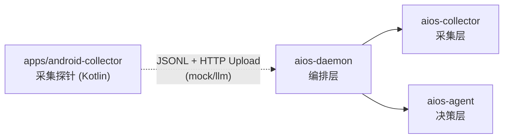

<div class="mt-4 text-sm opacity-75">
Android 系统服务层信号与 daemon 编排层汇合，再进入 Rust 采集层和决策层。
</div>

---

# 三、How — 系统全景架构 B

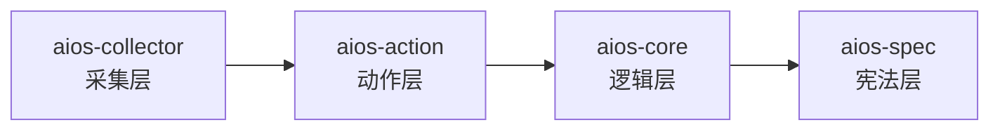

<div class="mt-3 text-sm opacity-75">
主线: 本地采集 → 本地脱敏 → 云端推理 → 本地校验 → 本地执行
</div>

---

# How · 系统全景架构 — 采集与调度层

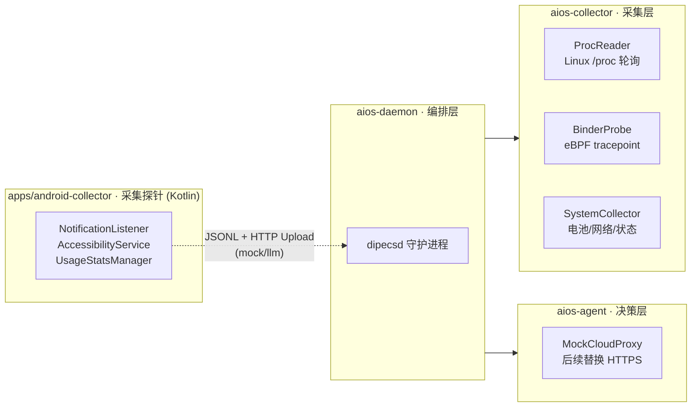

---

# How · 系统全景架构 — 核心与契约层

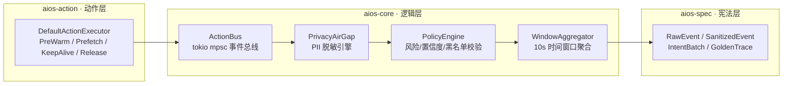

---

# How · 系统全景架构 — 模块职责

<div class="grid grid-cols-2 gap-4 mt-4 text-sm">

<div>

### 采集与调度

- `apps/android-collector`: Notification / Accessibility / UsageStats
- `aios-daemon`: `dipecsd` 主循环，负责长期运行和管道装配
- `aios-agent`: DecisionRouter / MockCloudProxy，负责意图生成
- `aios-collector`: `/proc`、Binder、系统状态等本地信号采集

</div>

<div>

### 安全与执行

- `aios-core`: `PrivacyAirGap`、`WindowAggregator`、`PolicyEngine`
- `aios-action`: `ActionExecutor` 执行预热、预取、保活、释放
- `aios-spec`: `RawEvent`、`SanitizedEvent`、`IntentBatch` 等契约

</div>

</div>

<div class="mt-5 p-3 border border-primary/20 rounded text-sm">

主线: **本地采集 → 本地脱敏 → 云端推理 → 本地策略校验 → 本地执行**。

</div>

---

# How · 数据闭环 — 采集到脱敏

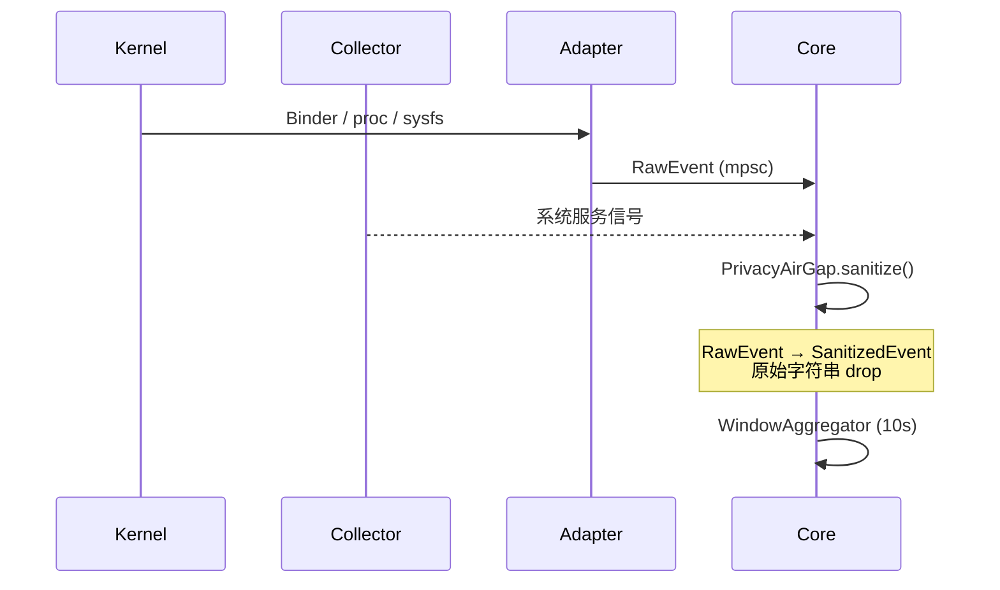

<div class="mt-4 text-sm opacity-75">

这一页只展示 **原始信号如何进入本地安全边界**。PII 在 `PrivacyAirGap` 内被消费，云端永远看不到原始字符串。

</div>

---

# How · 数据闭环 — 推理到执行

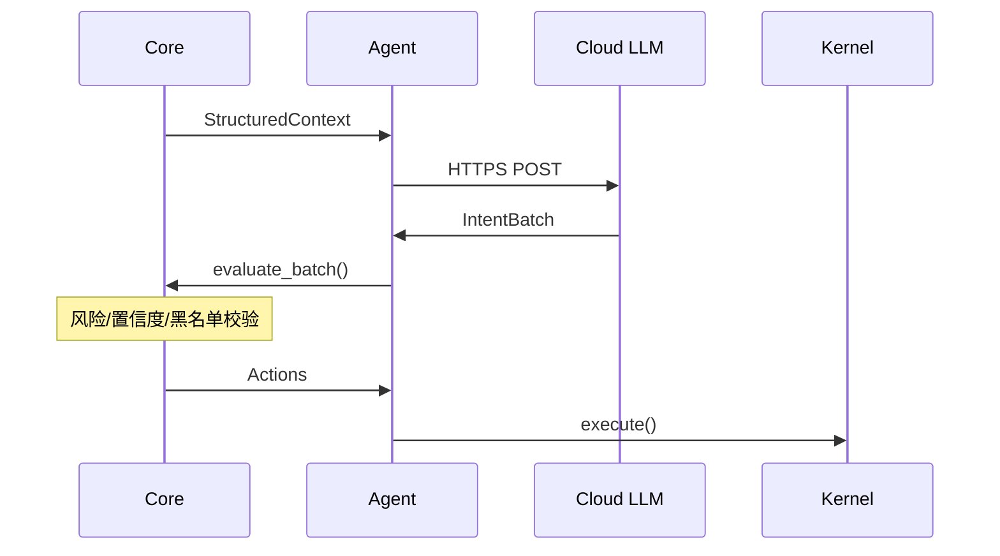

---

# How · 宪法层 — aios-spec

**职责**: 定义全系统 SSOT (Single Source of Truth)，零内部依赖

<div class="grid grid-cols-2 gap-4 mt-4 text-sm">

<div>

### 核心数据类型

- `RawEvent` — 8 种原始事件 (含 PII)
- `SanitizedEvent` — 7 种脱敏后事件 (无 PII)
- `StructuredContext` — 发送云端的唯一数据格式
- `IntentBatch` — 云端返回的结构化决策
- `GoldenTrace` — 确定性回放记录

</div>

<div>

### 辅助类型

- `TextHint` — 字符数 / 书写系统 / emoji
- `SemanticHint` — 语义标签 (文件/图片/金融/验证码)
- `ExtensionCategory` — 文件扩展名类别 (Document/Image/Video/...)
- `RiskLevel` — Low / Medium / High
- `ActionUrgency` — Immediate / IdleTime / Deferred

</div>

</div>

<v-click>

<div class="mt-4 p-3 border border-primary/20 rounded text-sm">

**设计约束**: 不依赖任何其他 crate，所有跨模块契约在此定义。任何增加必须通过架构审计。

</div>

</v-click>

---

# How · 隐私脱敏引擎深度解析

**PrivacyAirGap** — 系统最核心的安全边界 (391 行，5 个测试)

<div class="grid grid-cols-2 gap-4 mt-4 text-sm">

<div>

### 脱敏规则 (每种 RawEvent 一条路径)

| 原始数据 | 脱敏后保留 |
| :--- | :--- |
| 通知标题 / 正文 | `TextHint` (长度 + 书写系统 + 纯emoji标记) + `SemanticHint` (本地关键词匹配) |
| 文件路径 | `ExtensionCategory` (仅扩展名分类) |
| Binder 负载 | service 名 + 方法名 → `InteractionType` |
| /proc 数据 | 已为系统指标 → 直接保留 |

</div>

<div>

### 本地关键词匹配 (双语)

**中文**: 文件、图片、照片、视频、音频、链接、验证码、转账、红包、日历、邀请

**英文**: file, image, photo, video, audio, link, attachment, code, verify, calendar, invite, payment

<div class="mt-3 p-2 bg-primary/10 rounded">

```rust
// 关键: sanitize() 消费 RawEvent
// 返回后原始字符串的 ownership 已 drop
fn sanitize(&self, raw: RawEvent)
  -> SanitizedEvent;
```

</div>

</div>

</div>

---

# How · 策略引擎与上下文构建

<div class="grid grid-cols-2 gap-4 mt-2 text-sm">

<div>

### PolicyEngine (131 行，11 个测试)

校验云端返回的每个 Intent:

- **风险等级**: 默认仅 Low 自动执行 (可配置放宽至 Medium)
- **置信度阈值**: 拒绝 < 0.3 的意图
- **紧迫度过滤**: Deferred 动作被跳过
- **动作黑名单**: 可配置禁用的 ActionType
- **批量上限**: 每批次最多执行 5 个动作 (可配置)

</div>

<div>

### WindowAggregator (171 行，17 个测试)

将 `SanitizedEvent` 聚合为 10 秒时间窗口:

- **窗口生命周期**: push 事件 → 定时器 expire → close → 生成 `StructuredContext`
- **摘要生成**: 前台 App / 通知 App / 语义标签 / 文件活动计数 / 系统状态快照
- **SourceTier**: 任一 Daemon 级事件存在则整体标记为 Daemon

</div>

</div>

<v-click>

<div class="mt-4 p-3 border border-primary/20 rounded text-sm">

```
PolicyEngine 校验失败 → 动作被静默丢弃 + tracing::warn! 记录
PolicyEngine 校验通过 → 送入 ActionExecutor (当前为骨架，记录微秒级延迟)
```

</div>

</v-click>

---

# How · 平台采集层 — aios-collector

**职责**: 连接 Linux/Android 内核与核心引擎

<div class="grid grid-cols-2 gap-4 mt-4 text-sm">

<div>

### ProcReader (228 行)

- 轮询 `/proc/[pid]/{stat, status, oom_score, io, cmdline}`
- 差分算法: 只有状态变化的进程才产生 `ProcStateEvent`

### BinderProbe (137 行)

- 检测 binder tracepoint 是否存在
- 接口就绪，eBPF 实际挂载需 aya/libbpf-rs

</div>

<div>

### SystemStateCollector (101 行)

- 电池: `/sys/class/power_supply/`
- 网络: `/sys/class/net/*/operstate`
- 桌面 Linux fallback 值

### 采集频率

- `/proc` / Binder: 每 100ms
- 系统状态: 每 30s

</div>

</div>

---

# How · 守护进程流水线 — daemon 采集

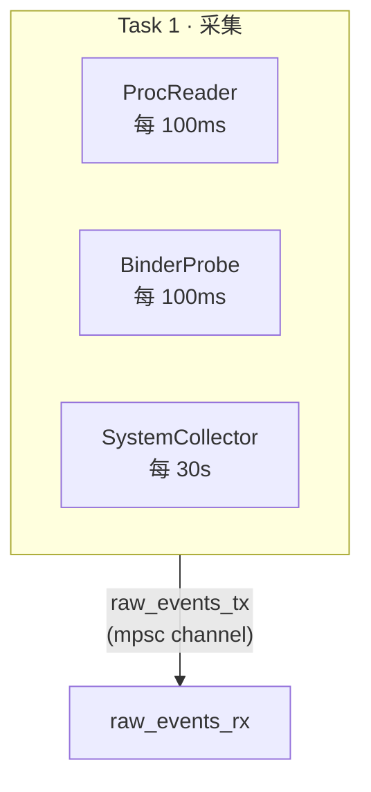

<div class="mt-3 text-sm opacity-75">
daemon 内部采集任务统一写入 `raw_events_tx`，主任务从 `raw_events_rx` 消费。
</div>

---

# How · 守护进程流水线 — Android 外部探针

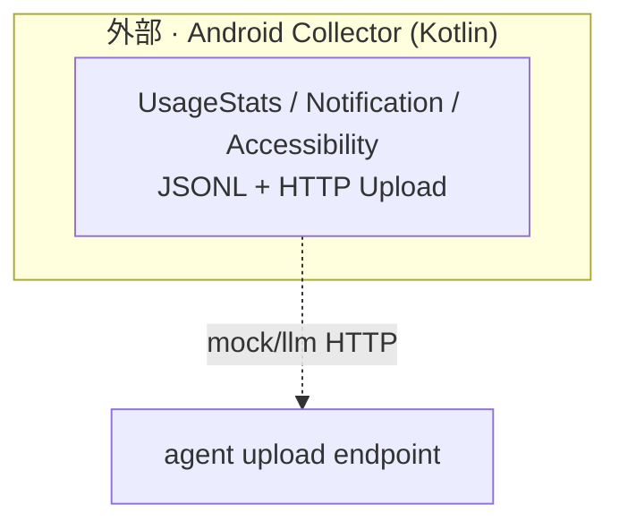

<div class="mt-3 text-sm opacity-75">
daemon 内部采集任务统一写入 `raw_events_tx`，主任务从 `raw_events_rx` 消费。
</div>

---

# How · 守护进程流水线 — Android 外部探针


<div class="mt-3 text-sm opacity-75">
系统服务层探针走独立通道，便于 Phase-1 验证 Android 接口可用性。
</div>

---

# How · 守护进程流水线 — 采集组件说明

<div class="grid grid-cols-2 gap-4 mt-4 text-sm">

<div>

### Rust daemon 采集任务

| 组件 | 频率 | 输出 |
| :--- | :--- | :--- |
| `ProcReader` | 100ms | 进程状态变化 |
| `BinderProbe` | 100ms | Binder 调用信号 |
| `SystemCollector` | 30s | 电量 / 网络 / 屏幕 |

<div class="mt-3 p-2 border border-primary/20 rounded text-xs">
统一写入 `raw_events_tx`，主任务从 `raw_events_rx` 消费。
</div>

</div>

<div>

### Android public-API bridge

| 数据源 | 通道 |
| :--- | :--- |
| UsageStats | JSONL |
| Notification | JSONL |
| Accessibility | JSONL |
| Upload Worker | HTTP mock/llm |

<div class="mt-3 p-2 border border-primary/20 rounded text-xs">
用于筛选 Android 系统服务接口，后续再并入 daemon。
</div>

</div>

</div>

---

# How · 守护进程流水线 — 主处理链路 A

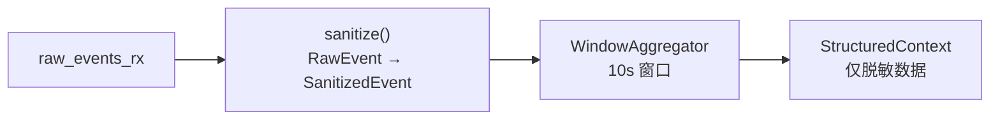

<div class="mt-4 text-sm opacity-75">
这一段只在本地执行：原始事件进入 `sanitize()`，随后聚合为 10s 窗口上下文。
</div>

---

# How · 守护进程流水线 — 主处理链路 B

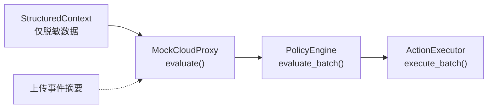

---

# How · 守护进程流水线 — 生命周期与边界

**生命周期**:

- fork + setsid (daemonize)
- `--no-daemon` 模式用于开发调试
- SIGTERM/SIGINT 通过 broadcast channel 优雅退出

---

# How · 守护进程流水线 — 关键设计

**关键设计**:

- 核心处理是同步的 (aios-core 无 async)
- 异步仅在 I/O 边界 (collector 读取 / agent HTTPS)
- 所有步骤通过 `tracing` 打点

---

# How · MockCloudProxy — 信号到意图的映射 A

当前阶段使用基于规则的模拟代理，6 条规则覆盖全部动作类型:

| 检测信号 | 生成意图 | 推荐动作 | 置信度 |
| :--- | :--- | :--- | :--- |
| 通知含 FileMention | `OpenApp(source_app)` | PreWarmProcess | 0.70 |
| ActivityLaunch 检测 | `SwitchToApp(target)` | PreWarmProcess + KeepAlive | 0.85 |
| 文件活动 (任意) | `HandleFile(ext_category)` | PrefetchFile | 0.75 |

---

# How · MockCloudProxy — 信号到意图的映射 B

| 检测信号 | 生成意图 | 推荐动作 | 置信度 |
| :--- | :--- | :--- | :--- |
| 屏幕 Interactive | `Idle` | KeepAlive(foreground) | 0.60 |
| 电量 < 20% | `Idle` | ReleaseMemory | 0.80 |
| 空窗口 (兜底) | `Idle` | NoOp | 0.50 |

<div v-click class="mt-3 text-sm opacity-75">

> 后续替换为 reqwest + rustls HTTPS 通信，`MockCloudProxy::evaluate()` 接口签名与真实 CloudProxy 完全一致。

</div>

---

# How · 当前状态与 Roadmap

<div class="grid grid-cols-2 gap-4 mt-4 text-sm">

<div>

### 已完成 (v0.3)

| 指标 | 数值 |
| :--- | :--- |
| 代码量 | ~4,300 行 Rust + ~1,500 行 Kotlin |
| Crates | 6 个 (spec/core/kernel/adapter/agent/cli) + 1 Android App |
| 测试 | 62 个 Rust · 全部通过 + Android Unit Test |
| 端到端管道 | 采集→脱敏→聚合→推理→校验→执行 |
| 新增 | AppTransition 事件 / android-collector / CollectionStats / CI |
| 编译 | `x86_64-linux-gnu` / `aarch64-linux-android` |
| Lint | clippy 零警告 |

</div>

<div>

### 近期计划 (v0.4+)

- **Cloud LLM**: 已接入 DeepSeek / Qwen / OpenAI-compatible，后续补真实 provider 回归样本
- **Action Executor**: 已接 Android `PrefetchFile(url:/uri:)` bridge，后续扩展 Android-safe 自有资源动作
- **文件监控**: FanotifyMonitor 实现
- **采集器集成**: Android `rawEvent` JSONL 已进入 daemon；JNI/socket 可作为后续低延迟替换路线
- **Trace 集成**: RuntimeTraceRecorder 与 replay/audit 已接入，后续补报告 artifact 汇总
- **真机验证**: Android 模拟器 / 真机端到端演示

</div>

</div>

---

# 总结: DiPECS 解决了什么

<v-clicks>

1. **定义了新的 OS 对象模型** — 从被动 App/Process 到主动 Intent/Action/Policy

2. **建立了隐私的硬边界** — Rust ownership 保证 PII 在内存中不可恢复，而非"承诺不上传"

3. **实现了机制-策略分离** — 云端推演策略，本地执行机制，中间经过 PolicyEngine 二次校验

4. **提供了确定性验证能力** — Golden Trace 回放确保任何代码修改不会引入隐私泄露或决策偏差

5. **打通了端到端管道** — 62 个测试覆盖从 /proc 到 ActionExecutor 的完整链路

</v-clicks>

<div v-click class="mt-8 text-center">

## 问题与讨论

</div>

---

# DiPECS v0.3

Digital Intelligence Platform for Efficient Computing Systems

<div class="mt-8 text-sm opacity-50">

[Project Repository](https://github.com/114August514/DiPECS) · Rust 1.95.0 · Apache 2.0

</div>
