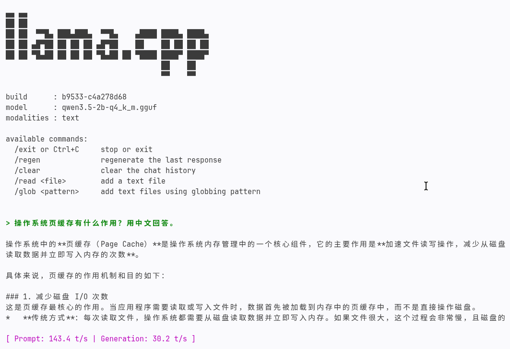

# Lab4 参数优化与性能指标实验报告

## 1. 性能指标列表

在 llama.cpp 推理系统中，我们选取以下 5 个核心性能指标进行评估：

| 指标 | 符号 | 定义 | 测量方式 | 重要性 |
| :--- | :--- | :--- | :--- | :--- |
| **Prompt 处理速度** | TPS_prompt | 输入 prompt 的 token 处理速度（tokens/s） | `llama-bench` 中 `n_gen=0` 的结果 | 决定首 token 返回时间，影响用户体验 |
| **Token 生成速度** | TPS_gen | 输出 token 的生成速度（tokens/s） | `llama-bench` 中 `n_prompt=0` 的结果 | 决定流式输出的流畅度 |
| **模型加载时间** | T_load | 从磁盘加载 GGUF 到内存（或 GPU）的耗时 | `llama-cli --show-timings` 中的 load time | 影响服务冷启动和首次请求延迟 |
| **内存占用** | MEM | 推理过程中的 RSS/峰值内存使用量 | `free -h` 或 `/proc/<pid>/status` | 决定能否在有限内存设备上运行 |
| **CPU 利用率** | CPU% | 推理时 CPU 时间占比 | `htop` 或 `ps` 采样 | 反映并行效率和资源竞争程度 |

**指标选取合理性**：

- **Prompt 处理速度**和**Token 生成速度**是推理系统的核心吞吐指标，分别对应"输入理解"和"输出生成"两个阶段。
- **模型加载时间**在实际部署中至关重要，尤其是服务器重启或模型切换场景。
- **内存占用**决定了模型的可部署范围，是边缘设备推理的关键约束。
- **CPU 利用率**帮助我们判断线程数配置是否合理——过高的利用率可能意味着上下文切换开销，过低则说明并行未充分利用。

---

## 2. 实验环境

| 项目 | 内容 |
| :--- | :--- |
| 主机 | Linux archlinux, i7-13700H (6P+8E, 20 threads), 15GiB RAM |
| 模型 | qwen3.5-2b-q4_k_m.gguf (Q4_K_M, ~1.3GB) |
| 工具 | `llama-bench` (commit c4a278d68) |
| 测试参数 | `--n-prompt 128 --n-gen 64 --repetitions 3 --n-gpu-layers 0` |

### 2.1 单机部署验证

先用 `llama-cli` 做一次简单推理，确认模型能正常加载和输出：

```bash
cd lab4/third_party/llama.cpp

./build/bin/llama-cli \
  -m ../../data/models/qwen3.5-2b-q4_k_m.gguf \
  -p "操作系统页缓存有什么作用？用中文回答。" \
  -n 64 --threads 8 -c 1024 \
  --seed 42 --temp 0.2 \
  --reasoning off --reasoning-budget 0 \
  --no-display-prompt --simple-io --show-timings
```

运行截图：



截图展示了 `llama-cli` 成功加载模型并生成中文回答的过程，验证单机部署有效。

---

## 3. 参数优化实验设计

测试 llama.cpp 中四个关键配置参数对性能的影响：

| 参数 | 测试值 | 说明 |
| :--- | :--- | :--- |
| `--threads` | 4, 8, 12 | 线程数，探索超线程拐点 |
| `--batch-size` | 32, 64, 128 | 批处理大小 |
| `--n-prompt` | 128, 512, 1024 | 输入长度（模拟不同 ctx-size 负载） |
| `--mmap` | 1 (默认), 0 | 内存映射 vs 直接加载 |

---

## 4. 实验结果

### 4.1 线程数对比（--threads）

| 配置 | Prompt (t/s) | Generation (t/s) | 相比 baseline |
| :--- | ---: | ---: | :--- |
| threads=4 | 152.38 | 30.34 | baseline |
| threads=8 | 180.99 | **34.16** | +18.8% / +12.6% |
| threads=12 | **208.73** | 33.89 | +37.0% / +11.7% |

**关键发现**：

- Prompt 处理速度随 4、8、12 线程稳定上升，12 线程比 4 线程高约 **37.0%**。
- Generation 在 8 线程达到 34.16 t/s，12 线程为 33.89 t/s，差异仅约 0.8%。
- i7-13700H 是 P-core/E-core 混合架构。prefill 更容易从矩阵并行中获益，而逐 token
  decode 更受内存带宽、同步和调度影响，因此线程增加不会让两个阶段同比例加速。

### 4.2 批处理大小对比（--batch-size）

| 配置 | Prompt (t/s) | Generation (t/s) |
| :--- | ---: | ---: |
| batch=32 | **203.56** | **31.00** |
| batch=64 | 152.80 | 29.37 |
| batch=128 | 157.47 | 29.65 |

**分析**：

- 本轮 `batch=32` 的 Prompt 吞吐最高，较 `batch=64` 高约 33.2%。
- 2B Q4_K_M 模型在 CPU 上增大 batch 会扩大工作集，可能增加末级缓存和内存带宽压力。
- Generation 差异小于 6%，说明 batch 对逐 token decode 的影响弱于对 prefill 的影响。

### 4.3 输入长度对比（--n-prompt）

| 配置 | Prompt (t/s) | Generation (t/s) |
| :--- | ---: | ---: |
| n-prompt=128 | **154.06** | 29.64 |
| n-prompt=512 | 147.26 | 30.89 |
| n-prompt=1024 | 141.98 | **31.23** |

**分析**：

- Prompt 吞吐随输入长度增长而下降：128 到 1024 token 下降约 7.8%。
- 更长输入会扩大激活和 KV cache 工作集，降低缓存局部性。
- Generation 吞吐略有上升，但变化小于 6%，应视为调度和温度状态噪声，不能据此断言长输入会加速 decode。

### 4.4 内存映射对比（--mmap）

| 配置 | Prompt (t/s) | Generation (t/s) | 冷启动加载时间 (ms) |
| :--- | ---: | ---: | ---: |
| mmap=1 (默认) | **155.38** | 31.03 | **676** |
| mmap=0 | 153.21 | **31.30** | 904 |

**分析**：

- 两种模式的**持续推理吞吐**差异不足 1.5%，稳态性能几乎相同。
- **模型加载时间**差异明显：`mmap` 冷启动约 676 ms，`no-mmap` 约 904 ms，前者快约 25%。这是因为 `mmap` 通过虚拟内存映射实现按需缺页，启动时只需建立页表映射，不必一次性将 1.3 GB 模型全部读入内存；配合页缓存，重复启动还能更快。
- `no-mmap` 启动时即完整读取模型到进程地址空间，加载更慢，但启动后不受后续缺页中断影响，运行期更稳定。
- 综合稳态性能和启动耗时，交互式、频繁启动的工作负载仍建议保留默认 `mmap`。

---

## 5. 优化结论

| 参数 | 最优配置 | 依据 |
| :--- | :--- | :--- |
| `--threads` | **12（prefill）/ 8（decode）** | 12 线程 Prompt 吞吐最高；8 与 12 的 Generation 基本持平 |
| `--batch-size` | **32** | 本轮 Prompt 和 Generation 吞吐均最高 |
| `--n-prompt` | 按实际任务 | 输入越长，Prompt 吞吐逐步下降 |
| `--mmap` | **1（默认）** | 稳态吞吐相近，但独立进程启动实验明显更快 |

**核心洞察**：
> 对于 i7-13700H + Qwen3.5-2B Q4_K_M，线程数仍是最明显的调优杠杆，
> 但 prefill 与 decode 的最优点不同。交互式配置可采用 `threads=8~12`、
> `batch=32`、`mmap=on`，再根据更看重首段处理速度还是逐 token 速度选择线程数。

### 5.1 优化方案与初步实现

本实验的优化目标不是追求极限吞吐，而是在 CPU-only 环境下给出可复现、不会明显增加
OOM 风险的配置。根据上面的测试结果，采用以下方案：

| 优化方向 | 实施方案 | 数据依据 | 系统解释 |
| :--- | :--- | :--- | :--- |
| 提升 prefill / 首段处理速度 | 批量或长 prompt 任务使用 `--threads 12` | Prompt 吞吐从 152.38 提升到 208.73 t/s（相对 4 线程 +37.0%） | prefill 矩阵计算更容易从多线程并行中获益 |
| 提升逐 token decode 稳定性 | 交互式生成优先使用 `--threads 8` | Generation 在 8 线程达到 34.16 t/s，12 线程为 33.89 t/s | decode 更受内存带宽、同步与调度影响，线程过多收益有限 |
| 降低 batch 工作集压力 | 使用 `--batch-size 32` | 相比 batch=64，Prompt 吞吐从 152.80 提升到 203.56 t/s | 较小 batch 减少缓存和内存带宽压力 |
| 缩短独立进程启动耗时 | 保留默认 `mmap` | 短请求启动 `mmap` 676.2 ms，`no-mmap` 904.0 ms | `mmap` 通过页缓存和按需缺页降低重复加载开销 |
| 控制内存占用 | `--ctx-size` 按任务长度设置，常规测试使用 1024 | 输入越长 Prompt 吞吐越低；RPC 中过大上下文曾触发从机 OOM | KV cache 随上下文增大，占用更多内存 |

初步实现命令如下：

```bash
cd lab4/third_party/llama.cpp

# 偏交互式：更看重逐 token 生成速度和稳定性
./build/bin/llama-cli \
  -m ../../data/models/qwen3.5-2b-q4_k_m.gguf \
  -p "用中文解释 mmap 如何影响模型加载。" \
  -n 128 \
  --threads 8 \
  --ctx-size 1024 \
  --batch-size 32 \
  --reasoning off \
  --reasoning-budget 0 \
  --no-display-prompt \
  --simple-io \
  --show-timings

# 偏批量 prefill：更看重 prompt 处理吞吐
./build/bin/llama-bench \
  -m ../../data/models/qwen3.5-2b-q4_k_m.gguf \
  --threads 12 \
  --batch-size 32 \
  --n-prompt 128 \
  --n-gen 64 \
  --repetitions 3
```

因此，本轮“优化方案”已经落到可执行参数上：`threads=8~12`、`batch=32`、
`ctx-size` 控制在任务需要范围内，并保留默认 `mmap`。质量评估和 RPC 对照中部分
命令继续使用 `batch=64`，是为了和前期对照组保持同一测量边界；参数优化实验本身
已经验证并给出最终推荐配置。

### 5.2 实验噪声说明

脚本在不同分组中重复执行了若干名义上相同的
`threads=12, batch=64, n-prompt=128, mmap=on` 配置，其 Prompt 吞吐存在明显跨轮波动。
这说明笔记本 CPU 的后台负载、频率、温度和 P/E core 调度会影响不同时间段的结果。
每条 `llama-bench` 记录内部仍重复 3 次并报告均值；报告只把同一连续分组内的趋势用于
参数结论，不把不同时间段的少量差异解释为确定的因果关系。

---

## 6. 原始数据

| 文件 | 说明 |
| :--- | :--- |
| `lab4/data/results/param-opt/param-opt-detail.jsonl` | 每组实验的原始 JSONL 输出 |
| `lab4/data/results/param-opt/param-opt-summary.json` | 汇总表格 |
| `lab4/scripts/param_optimization.py` | 实验脚本 |
